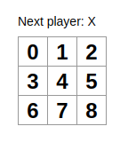

# Objectives

In this tutorial we will build an interactive *jogo da velha* game with React. This tutorial is a mere reproduction of
the official [React Tutorial](https://reactjs.org/tutorial/tutorial.html) adapted to work with React Hooks.

# Setup

Let's begin.

1. Create a new app by following `create-react-app` instructions:
    ```shell
    npx create-react-app gccurso
    ```

2. Erase all files inside `src/` directory.
    ```shell
    cd gccurso
    cd src
    rm -f *
    cd ..
    ```

3. Copy `starter/` files in this [Gitlab](example.com) to the `src/` directory.

Now, by running `npm start` in the project's directory and opening the [http://localhost:3000](http://localhost:3000) on
the browser we should see an empty *Jogo da Velha* grid.

# Overview

Now that we are all set-up, let's begin with an overview:

## What is React?

React is a JavaScript library for building user interfaces. It lets you compose complex UIs from small and isolated
pieces of code called **components**.

```javascript
const ShoppingList = (props) => {
    return (
        <div className="shopping-list">
            <h1>Shopping List for {props.name}</h1>
            <ul>
                <li>Coffee</li>
                <li>Coca</li>
                <li>Pasta</li>
            </ul>
        </div>
    );
}

// Example usage: <ShoppingList name="Matheus" />
```

Here, `ShoppingList` is a **React component**. A component takes in parameters, called props (short for “properties”),
and returns a hierarchy of views to display on the screen.

The `ShoppingList` component above only renders built-in DOM components like `<div />` and `<li />`. But you can compose
and render custom React components too. For example, we can now refer to the whole shopping list by
writing `<ShoppingList />`. Each React component is encapsulated and can operate independently; this allows you to build
complex UIs from simple components.

### WHat about React Hooks?

Initially, the way that we would write a React component would require it to be a `class` with state variables and
a `render` method to display the component in the screen. This usually result in more complex components to be harder to
understand. So, in React *16.8* we were introduced to *Hooks*, which let you use state and other React features without
writing a class.

Hooks are functions that let you “hook into” React state and lifecycle features from `function components`. Hooks don’t
work inside classes — they let you use React without classes.

For instance,

```javascript 
class Square extends React.Component {
  constructor(props) {
    super(props);
    this.state = {
      value: null,
    };
  }

  render() {
    return (
      <button className="square" onClick={() => console.log('click')}>
        {this.props.value}
      </button>
    );
  }
}
```

becomes just

```javascript 
const Square = () => {
  const [value, setValue] = useState(null);
  
  return (
    <button className="square" onClick={() => console.log('click')}>
      {value}
    </button>
  );
}
```

which looks much more cleaner.

#### State Hook

This example renders a counter. When you click the button, it increments the value:

```javascript 
import React, { useState } from 'react';

function Example() {
  // Declare a new state variable, which we'll call "count"
  const [count, setCount] = useState(0);

  return (
    <div>
      <p>You clicked {count} times</p>
      <button onClick={() => setCount(count + 1)}>
        Click me
      </button>
    </div>
  );
}
```

Here, `useState` is a Hook. We call it inside a function component to add some local state to it. React will preserve
this state between re-renders. `useState` returns a pair: the current state value and a function that lets you update
it. You can call this function from an event handler or somewhere else.

The only argument to `useState` is the initial state. In the example above, it is `0` because our counter starts from
zero.The state here doesn’t have to be an object — although it can be if you want. The initial state argument is only
used during the first render.

And yes, you can use the `State Hook` more than once in a single component:

```javascript 
function ExampleWithManyStates() {
    // Declare multiple state variables!
    const [age, setAge] = useState(42);
    const [fruit, setFruit] = useState('banana');
    const [todos, setTodos] = useState([{text: 'Learn Hooks'}]);
    // ...
}
```

#### Effect Hook

In a web application we often have to perform data fetching and subscriptions. In React these operations are called
“side effects” (or “effects” for short) because they can affect other components and can’t be done during rendering.

The Effect Hook, `useEffect`, adds the ability to perform side effects from a function component. For example, this
component sets the document title after React updates the DOM:

```javascript 
import React, {useState, useEffect} from 'react';

function Example() {
    const [count, setCount] = useState(0);

    // Similar to componentDidMount and componentDidUpdate:
    useEffect(() => {
        // Update the document title using the browser API
        document.title = `You clicked ${count} times`;
    });

    return (
        <div>
            <p>You clicked {count} times</p>
            <button onClick={() => setCount(count + 1)}>
                Click me
            </button>
        </div>
    );
}
```

When you call `useEffect`, you’re telling React to run your “effect” function after flushing changes to the DOM. Effects
are declared inside the component so they have access to its props and state. By default, React runs the effects after
every render — including the first render.

Often, effects create resources that need to be cleaned up before the component leaves the screen, such as a
subscription or timer ID. To do this, the function passed to `useEffect` may return a clean-up function. For example, to
create a subscription:

```javascript 
useEffect(() => {
    const subscription = props.source.subscribe();
    return () => {
        // Clean up the subscription
        subscription.unsubscribe();
    };
});
```

`useState` and `useEffect` are just basic Hooks. Checkout the
full [API Reference](https://reactjs.org/docs/hooks-reference.html) to learn more.

# Back to the Starter Code

Let's get back to our game! Open the `src/index.js` file in your favorite text editor.

This Starter Code is the base of what we’re building. We’ve provided the CSS styling so that you only need to focus on
learning React and programming the *jogo da velha*.

By inspecting the code, you’ll notice that we have three React components:

- Square
- Board
- Game

The `Square` component renders a single `<button>` and the `Board` renders 9 squares. The `Game` component renders a
board
with placeholder values which we’ll modify later. There are currently no interactive components.

## Playing with props

Let's play with our `Board` component by passing some data inside the props of `Square`. In Board’s `renderSquare`
method, change the code to pass a prop called `value` to the Square:

```javascript 
const Board = () => {
    const renderSquare = (i) => {
        return <Square value={i}/>;
    }
    {/* code */}
}
```

Then change Square to show that value by replacing {/* TODO */} with `{props.value}`:

```javascript 
const Square = (props) => {
    return (
        <button className="square">
            {props.value}
        </button>
    );
}
```

And we should see the new rendered component:



## Turning it into an Interative Component

Let’s fill the Square component with an “X” when we click it. First, change the button tag that is returned from the
Square component to this:

```javascript
const Square = (props) => {
    return (
        <button className="square" onClick={() => console.log("cliquei no quadrado", props.value)}>
            {props.value}
        </button>
    );
}
```

If you click on a Square now, you should see ‘cliquei no quadrado **i**’ in your browser's console (hit `F12` key to
open
the console).

As a next step, we want the Square component to *remember* that it got clicked, and fill it with an “X” mark. To
*remember* things, components use `state`. So, let's import the **State Hook** and set the Square value when clicked:

```javascript 
//Don't forget to import useState
import React, {useState} from 'react';

...

const Square = (props) => {
    const [value, setValue] = useState(null);
    return (
        <button className="square" onClick={() => setValue("X")}>
            {value}
        </button>
    );
}
```

If you click on any Square now, an X should show up.

# Completing the game

Now we have to implement the Square filling to be either "X" or "O" depending on the player's turn and find a way to
determine the winner.

## Lifting state up

Currently, each Square component maintains the game’s state. To check for a winner, we’ll maintain the value of each of
the 9 squares in one location.

Lifting state into a parent component is common when React components are refactored — let’s take this opportunity to
try it out.

Set the Board’s initial state to contain an array of 9 nulls corresponding to the 9 squares:

```javascript 
const Board = () => {
   const [squares, setSquares] = useState(Array(9).fill(null));
   const renderSquare = (i) => {
      return <Square value={i}/>;
   }
   {/*code*/}
}
```

When we fill the board in later, the `squares` array will look something like this:

```javascript 
[
  'O', null, 'X',
  'X', 'X', 'O',
  'O', null, null,
]
```

Now we have to update the code in order to modify the squares array from inside the Square component. For this, we will
resort to `props` again, but now we want it to have more than just a value, we want it to have the function that
triggers the value modification when `button` is clicked. Therefore, we will have to pass our on `onClick` function from
the Board to the Square:

```javascript 
const Board = () => {
    const [squares, setSquares] = useState(Array(9).fill(null));

    const handleClick = (i) => {
        const squares_copy = squares.slice();
        squares_copy[i] = 'X';
        setSquares(squares_copy);
    }

    const renderSquare = (i) => {
        return <Square value={squares[i]} onClick={() => handleClick(i)}/>;
    }
    {/*code*/}
}
```

and modify the Square as well:

```javascript 
const Square = (props) => {
    return (
        <button className="square" onClick={() => props.onClick()}>
            {props.value}
        </button>
    );
}
```

Note that in the previous code example, we suggested that you create a **copy** of the squares array using the `slice()`
method instead of modifying the existing array in order to preserve immutability.

Immutability makes complex features much easier to implement. Later in this tutorial, we will implement a “time travel”
feature that allows us to review the *jogo da velha*'s history and “jump back” to previous moves. This functionality
isn’t specific to games — an ability to undo and redo certain actions is a common requirement in applications. Avoiding
direct data mutation lets us keep previous versions of the game’s history intact, and reuse them later.

## Taking Turns

We still need to fix the game to allow us to mark "O" on the board. We’ll set the first move to be “X” by default by
creating a state `xIsNext` and setting it to `true`:

```javascript 
const Board = () => {
    const [squares, setSquares] = useState(Array(9).fill(null));
    const [xIsNext, setXIsNext] = useState(true);

    {/*code*/}
}
```

Each time a player moves, `xIsNext` (a boolean) will be flipped to determine which player goes next and the game’s state
will be saved. We’ll update the Board’s `handleClick` function to flip the value of `xIsNext`:

```javascript 
const handleClick = (i) => {
    const squares_copy = squares.slice();
    squares_copy[i] = xIsNext ? 'X' : 'O';
    setSquares(squares_copy);
    setXIsNext(!xIsNext);
}
```

With this change, “X” and “O” can take turns. Try it!

Let’s also change the “status” text in the Board so that it displays which player has the next turn:

```javascript 
const status = 'Next player: ' + (xIsNext ? "X" : "O");
```

## Declaring a winner

Now that we show which player’s turn is next, we should also show when the game is won and there are no more turns to
make. Copy this helper function and paste it at the end of the file:

```javascript 
const calculateWinner = (squares) => {
    const lines = [
        [0, 1, 2],
        [3, 4, 5],
        [6, 7, 8],
        [0, 3, 6],
        [1, 4, 7],
        [2, 5, 8],
        [0, 4, 8],
        [2, 4, 6],
    ];
    for (let i = 0; i < lines.length; i++) {
        const [a, b, c] = lines[i];
        if (squares[a] && squares[a] === squares[b] && squares[a] === squares[c]) {
            return squares[a];
        }
    }
    return null;
}
```

Given an array of 9 squares, this function will check for a winner and return `'X'`, `'O'`, or `null` as appropriate.

We will call `calculateWinner(squares)` in the Board component to check if a player has won. If a player has won, we can
display text such as “Winner: X” or “Winner: O”. We’ll replace the `status` declaration in the Board with this code:

```javascript 
const winner = calculateWinner(squares);
    let status;
    if (winner) {
        status = 'Winner: ' + winner;
    } else {
        status = 'Next player: ' + (xIsNext ? 'X' : 'O');
    }
```

We can now change the Board’s `handleClick` function to return early by ignoring a click if someone has won the game or
if a Square is already filled:

```javascript 
const handleClick = (i) => {
    if (calculateWinner(squares) || squares[i]) {
        return;
    }
    const squares_copy = squares.slice();
    squares_copy[i] = xIsNext ? 'X' : 'O';
    setSquares(squares_copy);
    setXIsNext(!xIsNext);
}
```

# Adding Time Travel

As a final exercise, let’s make it possible to “go back in time” to the previous moves in the game.

## Storing a history of moves

If we mutated the `squares` array, implementing time travel would be very difficult.

However, we used `slice()` to create a new copy of the `squares` array after every move, and treated it as immutable.
This
will allow us to store every past version of the `squares` array, and navigate between the turns that have already
happened.

We’ll store the past `squares` arrays in another array called `history`. The `history` array represents all board
states, from the first to the last move, and has a shape like this:

```javascript 
history = [
    // Before first move
    {
        squares: [
            null, null, null,
            null, null, null,
            null, null, null,
        ]
    },
    // After first move
    {
        squares: [
            null, null, null,
            null, 'X', null,
            null, null, null,
        ]
    },
    // After second move
    {
        squares: [
            null, null, null,
            null, 'X', null,
            null, null, 'O',
        ]
    },
    // ...
]
```

Now we need to decide which component should own the `history` state.

## Lifting State up, again!

We’ll want the top-level Game component to display a list of past moves. It will need access to the `history` to do
that,
so we will place the `history` state in the top-level Game component.

Placing the `history` state into the Game component lets us remove the `squares` state from its child Board component.
Just
like we “lifted state up” from the Square component into the Board component, we are now lifting it up from the Board
into the top-level Game component. This gives the Game component full control over the Board’s data, and lets it
instruct the Board to render previous turns from the `history`.

First, we’ll set up the initial state for the Game component:

```javascript 
const Game = () => {
    const [history, setHistory] = useState([{squares: Array(9).fill(null)}]);
    const [xIsNext, setXIsNext] = useState(true);
    // ...
}
```

Next, we’ll have the Board component receive `squares` and `onClick` props from the Game component. Since we now have a
single click handler in Board for many Squares, we’ll need to pass the location of each Square into the `onClick`
handler
to indicate which Square was clicked. Here are the required steps to transform the Board component:

- Add `props` to Board arguments
- Delete Board `states`
- Replace `squares[i]` with `props.squares[i]` in Board’s `renderSquare`.
- Replace `handleClick(i)` with `props.onClick(i)` in Board’s `renderSquare`.
- Delete `handleClick(i)` function.

The Board component now looks like this:

```javascript 
const Board = (props) => {
    const renderSquare = (i) => {
        return <Square value={props.squares[i]} onClick={() => props.onClick(i)}/>;
    }

    return (
        <div>
            <div className="status">{status}</div>
            <div className="board-row">
                {renderSquare(0)}
                {renderSquare(1)}
                {renderSquare(2)}
            </div>
            <div className="board-row">
                {renderSquare(3)}
                {renderSquare(4)}
                {renderSquare(5)}
            </div>
            <div className="board-row">
                {renderSquare(6)}
                {renderSquare(7)}
                {renderSquare(8)}
            </div>
        </div>
    );
}
```

We’ll update the Game component to use the most recent history entry to determine and display the game’s status:

```javascript 
const Game = () => {
    const [history, setHistory] = useState([{squares: Array(9).fill(null)}]);
    const [xIsNext, setXIsNext] = useState(true);
    
    const current = history[history.length - 1];
    const winner = calculateWinner(current.squares);
    let status;
    if (winner) {
        status = 'Winner: ' + winner;
    } else {
        status = 'Next player: ' + (xIsNext ? 'X' : 'O');
    }
    return (
        <div className="game">
            <div className="game-board">
                <Board squares={current.squares}
                       onClick={(i) => handleClick(i)}/>
            </div>
            <div className="game-info">
                <div>{status}</div>
                <ol>{/* TODO */}</ol>
            </div>
        </div>
    );
}
```

Since the Game component is now rendering the game’s status, we can remove the corresponding code from the Board:

```javascript 
return (
    <div>
        <div className="board-row">
            {renderSquare(0)}
            {renderSquare(1)}
            {renderSquare(2)}
        </div>
        <div className="board-row">
            {renderSquare(3)}
            {renderSquare(4)}
            {renderSquare(5)}
        </div>
        <div className="board-row">
            {renderSquare(6)}
            {renderSquare(7)}
            {renderSquare(8)}
        </div>
    </div>
);
```

Finally, we need to rewrite the `handleClick` method from the Board component to the Game component. Within the
Game’s `handleClick` method, we concatenate new `history` entries onto `history`.

```javascript 
const handleClick = (i) => {
    const squares = current.squares.slice();
    if (calculateWinner(squares) || squares[i]) {
        return;
    }
    squares[i] = xIsNext ? 'X' : 'O';
    setHistory(history.concat([{
        squares: squares,
    }
    ]));
    setXIsNext(!xIsNext);
}
```

Note that we used the `concat()` method because it doesn't mutate the original array.

## Showing Past Moves

Since we are recording the tic-tac-toe game’s history, we can now display it to the player as a list of past moves.
Using the `map` method, we can map our history of moves to React elements representing buttons on the screen, and
display
a list of buttons to “jump” to past moves.

Let’s `map` over the `history`:

```javascript 
const Game = () => {
    // ...

    const moves = history.map((step, move) => {
        const desc = move ?
            'Go to move #' + move :
            'Go to game start';
        return (
            <li key={move}>
                <button onClick={() => jumpTo(move)}>{desc}</button>
            </li>
        );
    });

    const winner = calculateWinner(current.squares);
    let status;
    if (winner) {
        status = 'Winner: ' + winner;
    } else {
        status = 'Next player: ' + (xIsNext ? 'X' : 'O');
    }
    return (
        <div className="game">
            <div className="game-board">
                <Board squares={current.squares}
                       onClick={(i) => handleClick(i)}/>
            </div>
            <div className="game-info">
                <div>{status}</div>
                <ol>{moves}</ol>
            </div>
        </div>
    );
}
```

As we iterate through history array, `step` variable refers to the current history element value, and `move` refers to
the current history element index. We are only interested in `move` here, hence `step` is not getting assigned to
anything.

For each `move` in the *jogo da velha*’s history, we create a list item `<li>` which contains a button `<button>`. Note
that in our game’s history each past move has a unique ID associated with it: it’s the sequential number of the move.
The moves are never re-ordered, deleted, or inserted in the middle, so it’s safe to use the move index as the list key.

The button has a `onClick` handler which calls a method called `jumpTo()`, which is our **Time Travel Machine**.

## Implementing Time Travel

By now our application's screen is screaming at us to implement the `jumpTo` method is undefined. Before we implement
jumpTo, we’ll add `stepNumber` to the Game component’s state to indicate which step we’re currently viewing.

```javascript 
const Game = () => {
    const [history, setHistory] = useState([{squares: Array(9).fill(null)}]);
    const [xIsNext, setXIsNext] = useState(true);
    const [stepNumber, setStepNumber] = useState(0);
    // ...
}
```

Next, we’ll define the `jumpTo` method in Game to update that `stepNumber`. We also set `xIsNext` to true if the number
that we’re changing `stepNumber` to is even:

```javascript 
const jumpTo = (step) => {
    setStepNumber(step);
    setXIsNext((step % 2) === 0);
}
```

Notice in `jumpTo` method, we haven’t updated history yet.

We will now make a few changes to the Game’s `handleClick` method to update `stepNumber` as we make a new move. We will
also add a `history_copy` variable to hold `history.slice(0, stepNumber + 1)`. This ensures that if we “go back in
time” and then make a new move from that point, we throw away all the “future” history that would now be incorrect.

```javascript 
const handleClick = (i) => {
    const history_copy = history.slice(0, stepNumber + 1);
    const squares = current.squares.slice();
    if (calculateWinner(squares) || squares[i]) {
        return;
    }
    squares[i] = xIsNext ? 'X' : 'O';
    setHistory(history_copy.concat([{
        squares: squares,
    }
    ]));
    setXIsNext(!xIsNext);
    setStepNumber(history_copy.length)
}
```

Finally, we will modify the Game component from always rendering the last move to rendering the currently selected move
according to `stepNumber`:

```javascript
const Game = () => {
    const [history, setHistory] = useState([{squares: Array(9).fill(null)}]);
    const [xIsNext, setXIsNext] = useState(true);
    const [stepNumber, setStepNumber] = useState(0);

    const current = history[stepNumber];
    // ...
}
```

If we click on any step in the game’s history, the *jogo da velha* board should immediately update to show what the
board looked like after that step occurred.

# Ionic?

What if instead of using default `HTML` elements like `buttons` and `divs` we could include a whole arsenal of fancy
Components to make our interface more pretty? That's where [Ionic](https://ionicframework.com/docs/) enters!